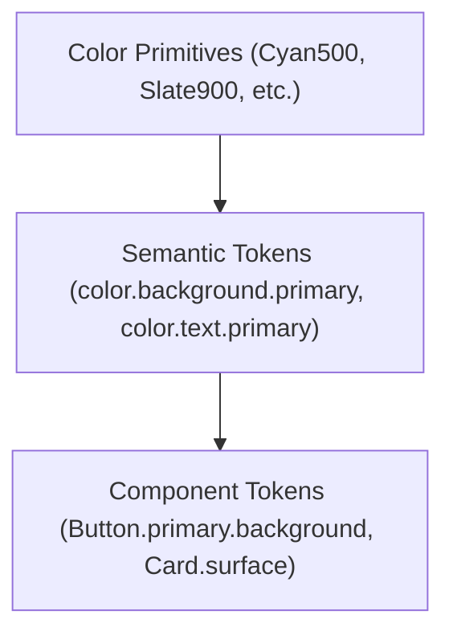

# 🎨 MOBILE DESIGN SYSTEM: AiPdfReaderEditor

> **Document Version**: `1.0.0`  
> **Status**: `APPROVED FOR IMPLEMENTATION`  
> **UI Stack**: Jetpack Compose (BOM 2026.08.00) + Material 3 (1.4.0)

---

# 0. DESIGN SYSTEM STRATEGY & PRINCIPLES

### 0.1 Product Personality
- **Minimalist**: Clean surfaces, zero visual clutter, no decorative drop shadows. Content-first.
- **Modern**: Contemporary geometric sans-serif typography, vibrant high-contrast accents.
- **Snappy & Fast**: Predictable, frictionless actions. Direct touch feedback under 16ms (60–120 FPS).
- **Trustworthy**: Robust error states, transparent token metering, zero intrusive ad popups.

### 0.2 Core Design Principles
1. **One Primary Action per Screen**: Never confuse the user with multiple high-emphasis buttons in the same viewport.
2. **Spacing Over Dividers**: Rely on consistent 4dp-grid whitespace rather than heavy line dividers.
3. **Never Rely Solely on Color**: Every status (Error, Success, Warning) must pair color with an icon and clear copy.
4. **Interactive Elements Must Look Interactive**: Consistent 12dp/16dp rounded geometry, subtle pressed ripple states.
5. **Native Non-Intrusive Ads**: Sponsored content must adopt the shape, typography, and elevation of native document/tool cards with a clean `[ Ad ]` badge.

---

# 1. BRAND FOUNDATION & IDENTITY

### 1.1 Brand Color Anchor
- **Primary Accent**: Electric Cyan (`#00E5FF` in Dark, `#00838F` in Light).
- **Secondary Accent**: Cyan Dark / Variant (`#00B8D4` in Dark, `#00ACC1` in Light).
- **Dark Neutral Base**: Deep OLED Black (`#121212`), Surface Dark (`#1E1E1E`), Surface Variant (`#2C2C2C`).
- **Light Neutral Base**: Clean White Surface (`#F8F9FA`), Elevated Container (`#FFFFFF`), Border Subtle (`#E2E8F0`).

---

# 2. COLOR ARCHITECTURE & TOKEN SPECIFICATION



## 2.1 Primitive Color Palette
```kotlin
// Cyan & Teal Primitives
val Cyan50 = Color(0xFFE0F7FA)
val Cyan100 = Color(0xFFB2EBF2)
val Cyan400 = Color(0xFF26C6DA)
val Cyan500 = Color(0xFF00BCD4)
val CyanAccent = Color(0xFF00E5FF)
val CyanDark = Color(0xFF00838F)

// Slate & Neutral Primitives
val Slate950 = Color(0xFF0F172A)
val Slate900 = Color(0xFF121212) // Deep OLED Black
val Slate800 = Color(0xFF1E1E1E) // Surface Dark
val Slate700 = Color(0xFF2C2C2C) // Surface Variant
val Slate600 = Color(0xFF475569)
val Slate400 = Color(0xFF94A3B8)
val Slate200 = Color(0xFFE2E8F0)
val Slate100 = Color(0xFFF1F5F9)
val Slate50 = Color(0xFFF8F9FA) // Light Background

// Feedback Primitives
val Red500 = Color(0xFFEF4444)
val Red400 = Color(0xFFF87171)
val Emerald500 = Color(0xFF10B981)
val Amber500 = Color(0xFFF59E0B)
```

## 2.2 Semantic Color Mapping: Light vs. Dark Themes

| Semantic Token | Dark Mode (Default) | Light Mode | Usage |
|---|---|---|---|
| `color.background.primary` | `#121212` (Slate900) | `#F8F9FA` (Slate50) | Main screen canvas |
| `color.surface.primary` | `#1E1E1E` (Slate800) | `#FFFFFF` (White) | Cards, sheets, dialog surfaces |
| `color.surface.variant` | `#2C2C2C` (Slate700) | `#F1F5F9` (Slate100) | Secondary containers, list headers |
| `color.text.primary` | `#F1F5F9` (95% White) | `#0F172A` (Slate950) | High-emphasis titles, body text |
| `color.text.secondary` | `#94A3B8` (Slate400) | `#64748B` (Slate500) | Metadata, dates, subheaders |
| `color.text.disabled` | `#475569` (Slate600) | `#94A3B8` (Slate400) | Disabled buttons, placeholders |
| `color.action.primary` | `#00E5FF` (CyanAccent) | `#00838F` (CyanDark) | Primary CTA buttons, active tabs |
| `color.action.onPrimary` | `#121212` (Deep Black) | `#FFFFFF` (White) | Text/icons inside primary buttons |
| `color.border.subtle` | `#2C2C2C` (Slate700) | `#E2E8F0` (Slate200) | 1dp card borders, chip outlines |
| `color.border.focus` | `#00E5FF` (CyanAccent) | `#00838F` (CyanDark) | Focused input fields, selected cards |
| `color.feedback.error` | `#F87171` (Red400) | `#EF4444` (Red500) | Destructive actions, error banners |
| `color.feedback.success` | `#34D399` (Emerald400) | `#10B981` (Emerald500) | Operation success, credit awards |
| `color.feedback.warning` | `#FBBF24` (Amber400) | `#F59E0B` (Amber500) | Insufficient credits, file warnings |

---

# 3. TYPOGRAPHY SYSTEM

The typography scale uses a clean sans-serif typeface (Google Inter / Roboto) with strict optical sizing:

```kotlin
val AppTypography = Typography(
    displayLarge = TextStyle(
        fontFamily = FontFamily.SansSerif,
        fontWeight = FontWeight.Bold,
        fontSize = 32.sp,
        lineHeight = 40.sp,
        letterSpacing = (-0.25).sp
    ),
    headlineMedium = TextStyle(
        fontFamily = FontFamily.SansSerif,
        fontWeight = FontWeight.SemiBold,
        fontSize = 24.sp,
        lineHeight = 32.sp,
        letterSpacing = 0.sp
    ),
    titleLarge = TextStyle(
        fontFamily = FontFamily.SansSerif,
        fontWeight = FontWeight.SemiBold,
        fontSize = 20.sp,
        lineHeight = 26.sp,
        letterSpacing = 0.15.sp
    ),
    titleMedium = TextStyle(
        fontFamily = FontFamily.SansSerif,
        fontWeight = FontWeight.Medium,
        fontSize = 16.sp,
        lineHeight = 22.sp,
        letterSpacing = 0.15.sp
    ),
    bodyLarge = TextStyle(
        fontFamily = FontFamily.SansSerif,
        fontWeight = FontWeight.Normal,
        fontSize = 16.sp,
        lineHeight = 24.sp,
        letterSpacing = 0.5.sp
    ),
    bodyMedium = TextStyle(
        fontFamily = FontFamily.SansSerif,
        fontWeight = FontWeight.Normal,
        fontSize = 14.sp,
        lineHeight = 20.sp,
        letterSpacing = 0.25.sp
    ),
    labelLarge = TextStyle(
        fontFamily = FontFamily.SansSerif,
        fontWeight = FontWeight.SemiBold,
        fontSize = 14.sp,
        lineHeight = 20.sp,
        letterSpacing = 0.1.sp
    ),
    labelSmall = TextStyle(
        fontFamily = FontFamily.SansSerif,
        fontWeight = FontWeight.Medium,
        fontSize = 11.sp,
        lineHeight = 16.sp,
        letterSpacing = 0.5.sp
    )
)
```

---

# 4. SPACING & LAYOUT SYSTEM

Based on a strict **4dp baseline grid**:

```kotlin
object Spacing {
    val none: Dp = 0.dp
    val xs: Dp = 4.dp     // Tight icon-to-text spacing
    val sm: Dp = 8.dp     // Internal chip/badge padding
    val md: Dp = 12.dp    // Compact list item padding
    val lg: Dp = 16.dp    // Standard screen margins & card padding
    val xl: Dp = 24.dp    // Section header spacing
    val xxl: Dp = 32.dp   // Major component blocks
    val xxxl: Dp = 48.dp  // Empty state vertical gaps
}
```

### Layout Rules:
- **Screen Margins**: Mobile portrait: `16dp`. Tablet / Landscape: `24dp`.
- **Card Padding**: Standard: `16dp`. Compact Tool item: `12dp`.
- **List Vertical Rhythm**: `8dp` space between cards in feeds.
- **Grid Gutters**: `12dp` horizontal & vertical spacing in 2-column tool grids; `8dp` in 3-column PDF thumbnail grids.

---

# 5. CORNER RADIUS & ELEVATION

```kotlin
object Shapes {
    val none: CornerBasedShape = RoundedCornerShape(0.dp)
    val xs: CornerBasedShape = RoundedCornerShape(4.dp)   // Checkboxes, tags
    val sm: CornerBasedShape = RoundedCornerShape(8.dp)   // Thumbnail preview corners
    val md: CornerBasedShape = RoundedCornerShape(12.dp)  // Buttons, text inputs
    val lg: CornerBasedShape = RoundedCornerShape(16.dp)  // Cards, dialog containers
    val xl: CornerBasedShape = RoundedCornerShape(24.dp)  // Bottom sheets
    val full: CornerBasedShape = RoundedCornerShape(999.dp) // Chips, badges, FAB
}
```

### Depth & Elevation:
- Rather than heavy drop shadows, surfaces rely on **elevation tones** and **subtle 1dp borders**:
  - `Elevation 0`: Flat screen background.
  - `Elevation 1`: Cards & List items (`1dp` border `color.border.subtle`).
  - `Elevation 2`: Floating action buttons, dialogs, bottom sheets.

---

# 6. ICONOGRAPHY SYSTEM

- **Source**: Google Material 3 Symbols (Rounded style).
- **Standard Sizes**:
  - `16dp`: Micro badges, status pills, inline token counts.
  - `20dp`: Input field trailing icons, chip leading icons.
  - `24dp`: App bar navigation, primary button leading icons, list item actions.
  - `32dp`: Large tool grid hero icons.
  - `48dp`: Empty state / illustration anchors.

---

# 7. CORE COMPONENT SPECIFICATIONS

## 7.1 Buttons (`AppButton`)
- **Primary CTA**: Filled with `color.action.primary`, text `color.action.onPrimary`, radius `12dp`, height `48dp`. Supports loading spinner state.
- **Secondary**: Outlined with `1.5dp` border `color.action.primary`, text `color.action.primary`.
- **Destructive**: Filled or outlined with `color.feedback.error` (used for "Delete Pages").
- **Icon Button**: `48dp x 48dp` minimum touch target with centered `24dp` icon and subtle ripple.

## 7.2 Text Inputs (`AppSearchField` & `AppTextField`)
- Height: `52dp`. Radius: `12dp`.
- Background: `color.surface.variant`.
- Border: `1dp` subtle, animating to `2dp` `color.border.focus` when active.
- Integrated clear `(X)` trailing icon when text is non-empty.
- Built-in `300ms` debounce support for search queries.

## 7.3 Document List Item (`DocumentCard`)
- Container: Radius `16dp`, background `color.surface.primary`, `1dp` border `color.border.subtle`.
- Layout:
  - Leading: `48dp x 64dp` aspect-ratio PDF thumbnail with `8dp` rounded corners.
  - Center: Document title (max 1 line, ellipsis), formatted date, page count, file size.
  - Trailing: Overflow icon button (`...`) opening action menu (Rename, Share, Delete).

## 7.4 Blended Native Ad Card (`BlendedAdCard`)
- Container: Exact same dimensions, `16dp` radius, and `color.surface.primary` as `DocumentCard`.
- Layout:
  - Leading: Styled icon or sponsored creative thumbnail (`48dp x 64dp`).
  - Center: Sponsored advertiser headline and short body.
  - Trailing: Subtle pill badge `[ Ad ]` (`11sp`, `labelSmall`, border `1dp Slate400`).
  - *No jarring background colors, flashing banners, or layout shifts.*

## 7.5 PDF Grid Thumbnail Item (`PdfThumbnailItem`)
- Aspect Ratio: Standard A4 ($1 : 1.414$).
- Corner Radius: `8dp`.
- States:
  - **Normal**: Direct bitmap draw with `1dp` border.
  - **Selected**: `3dp` border `color.action.primary` with top-right circular checkmark badge.
  - **Dragging**: Highlighted overlay during drag-to-select range gestures.
- Long-Press Gesture: Triggers high-resolution fullscreen preview dialog with pinch-to-zoom.

## 7.6 Dialogs & Bottom Sheets
- **Alert / Confirm Dialog**: Radius `16dp`, background `color.surface.primary`, title `titleLarge`, message `bodyMedium`, stacked or row buttons.
- **Modal Bottom Sheet**: Radius `24dp` on top corners, visible drag handle (`32dp x 4dp`), dismissible via swipe down or back press.
- **Insufficient Credits Dialog**: Shows required token credits, current balance, and one-tap "Earn 5 Credits (Watch Ad)" action.

---

# 8. JETPACK COMPOSE THEME ARCHITECTURE

```kotlin
// In :core:designsystem
@Composable
fun AiPdfTheme(
    darkTheme: Boolean = isSystemInDarkTheme(),
    content: @Composable () -> Unit
) {
    val colorScheme = if (darkTheme) DarkColorScheme else LightColorScheme
    
    CompositionLocalProvider(
        LocalSpacing provides Spacing,
        LocalShapes provides Shapes
    ) {
        MaterialTheme(
            colorScheme = colorScheme,
            typography = AppTypography,
            content = content
        )
    }
}
```

---

# END OF MOBILE DESIGN SYSTEM
