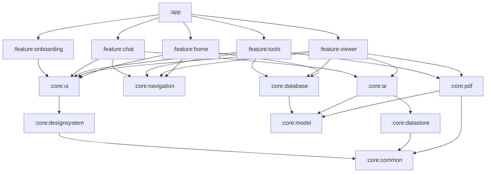
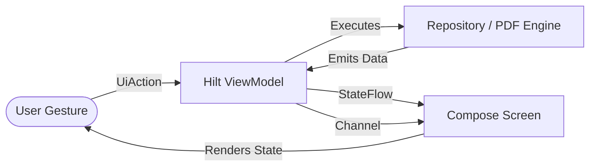

# 📱 MOBILE SYSTEM DESIGN: AiPdfReaderEditor

> **Document Version**: `1.0.0`  
> **Status**: `APPROVED FOR IMPLEMENTATION`  
> **Target Platform**: Android (minSdk: 26, compileSdk: 37, targetSdk: 37)  
> **Tech Stack**: Kotlin 2.4.10, Jetpack Compose (BOM 2026.08.00), Material 3, Dagger-Hilt 2.60.1, Room 3 (Bundled SQLite, KSP), Navigation Compose 2.9.8 (Type-Safe), Firebase Vertex AI (`gemini-3.7-flash`), Google Mobile Ads (AdMob Blended), Coil 3.

---

# 0. DOCUMENT CONTROL & REVISION HISTORY

## Project Information

| Field | Value |
|---|---|
| **Application Name** | `AiPdfReaderEditor` |
| **Application ID** | `pavansaiajayx.aipdfreadereditor.app` |
| **Architecture Pattern** | Multi-Module Clean Architecture + MVVM + UDF + StateFlow |
| **Minimum Android SDK** | `26` (Android 8.0 Oreo) |
| **Target / Compile SDK** | `37` (Android 16) |
| **Build Tooling** | Gradle 9.3.1 (Kotlin DSL), KSP 2.3.10, Version Catalog (`libs.versions.toml`) |
| **UI Framework** | 100% Jetpack Compose with Material 3 Design Tokens |
| **Target Demographic** | Gen Z, University Students, Modern Professionals |

## Sign-Off Checklist
- [x] Product Requirements & User Flows Approved
- [x] Multi-Module Topology & Dependency Graph Approved
- [x] Token-Cost Credit Economy Model Approved
- [x] Blended Native / Feed List Ads Approved
- [x] Memory-Safe PDF Pipeline & Gesture Engine Approved
- [x] Scoped Storage (MediaStore Single + SAF Batch) Approved
- [x] Testing Strategy & Verification Gates Approved

---

# 1. PRODUCT OVERVIEW & VALUE PROPOSITION

## 1.1 Product Description
**AiPdfReaderEditor** is an ultra-fast, modern, privacy-respecting Android PDF utility and intelligence workstation. It bridges the gap between traditional clunky desktop-ported PDF tools and modern mobile-first design. 

The application offers two distinct functional pillars:
1. **100% Free Offline Utilities**: Complete offline tools for viewing, merging, splitting, reordering, deleting, compressing, scanning, annotating, and converting PDFs with zero ads or paywalls blocking core functionality.
2. **Token-Metered AI Workstation**: Seamless conversational Q&A, deep multi-page summarization, and OCR intelligence powered by Google's Gemini models via Firebase Vertex AI, metered transparently based on actual input/output token usage.

## 1.2 Core Value Propositions
- **No Free-Feature Hostage Taking**: Basic utilities never ask for credits, never require network connectivity, and never display intrusive full-screen interstitial ads.
- **Fair Token-Cost Economy**: Rather than charging flat credit fees, AI operations calculate actual token consumption (input tokens + output tokens) so short queries cost fractions of a credit, while complex summaries are billed fairly.
- **Zero-Flicker, Zero-Lag Viewing**: Built from the ground up with bounded native rendering pools (`PdfRendererPool`) and safe byte-counted LRU memory caching to eliminate OOMs and thumbnail flicker.
- **Native-Blended Experience**: Dark-mode-first aesthetic with a clean light-mode counterpart, flat component geometry, and ads that blend seamlessly as styled list items rather than disruptive banner bars.

---

# 2. REQUIREMENTS SPECIFICATION

## 2.1 Functional Requirements

### F-01: Document Viewing & Navigation
- High-framerate vertical and horizontal continuous scrolling of PDF pages.
- Pinch-to-zoom (1.0x to 5.0x) with double-tap zoom resets.
- Rapid page scrubber slider with real-time page index badge (`Page X of Y`).
- In-document keyword search with highlighted bounding boxes and next/previous match navigation.
- Multi-format fallback viewer for images, text files, and standard documents.

### F-02: Offline PDF Utility Suite (100% Free & Offline)
- **Merge**: Select multiple PDFs, drag-and-drop reorder files, and combine into a single PDF.
- **Split**: Interactive thumbnail grid to split by page ranges, odd/even pages, or into individual page files.
- **Extract Pages**: Select arbitrary pages via tap or drag-selection to export into a new standalone PDF.
- **Delete Pages**: Select and delete arbitrary pages, generating a pruned document.
- **Reorder Pages**: Visual drag-and-drop grid to reorganize page sequences.
- **Rotate Pages**: Rotate individual or all pages clockwise/counterclockwise (90°, 180°, 270°).
- **Compress**: Adjustable compression ratio (Low, Medium, High) downsampling embedded images without destroying text vectors.
- **Images to PDF**: Convert camera shots or gallery photos into standardized A4/Letter PDFs with margin controls and OOM-safe downsampling.
- **PDF to Images**: High-resolution rasterization of selected or all PDF pages into JPEG/PNG images saved to a user-selected folder.
- **Document Scanner**: Hardware camera scanning powered by ML Kit Document Scanner (automatic corner detection, perspective correction, contrast enhancement, shadow removal).
- **Security**: AES password encryption (Standard Security Handler) and password removal (decryption).
- **Watermarking**: Stamp custom text or image watermarks with adjustable opacity, angle, and position.
- **Flattening**: Flatten AcroForm interactive fields into static document graphics.
- **HTML to PDF**: Convert raw HTML strings or web URLs into paginated PDF documents.
- **Text Stripper**: Extract raw selectable text to clipboard or text file via Apache PDFBox Android.

### F-03: Annotation & Editing Engine (100% Free & Offline)
- WYSIWYG drawing canvas overlaid directly onto rendered PDF pages.
- Freehand pen with customizable stroke width, smoothing, and color picker.
- Semi-transparent highlighter brush with blend mode preservation.
- Text annotation stamps with custom fonts, colors, and background boxes.
- E-signature capture with vector path smoothing and stamp placement.
- Undo, redo, clear all, and non-destructive draft caching before export.

### F-04: AI Intelligence Suite (Token-Cost Gated)
- **Document Summarization**: Summarize multi-page PDFs with executive takeaways, bullet points, and key metrics.
- **Interactive Chat with PDF**: Multi-turn conversational Q&A grounded strictly in document contents with page citations.
- **On-Device OCR Text Recognition**: Extract text from scanned/image-only PDF pages using on-device ML Kit OCR.
- **Token-Based Economy Calculation**: Pre-flight minimum balance check (`credits >= 1`). On response completion, read `usageMetadata` (prompt tokens + candidate tokens) and deduct credits based on formula.
- **Out of Credits Handling**: Emit explicit `InsufficientCredits(cost, balance)` event, presenting the user with an "Earn Credits" Rewarded Ad dialog or In-App Purchase option.

### F-05: Storage, File Management & History
- Scoped Storage compliance (SDK 26–37):
  - Single-file exports save directly to `MediaStore.Files` in `Documents/AiPdfReaderEditor` with `IS_PENDING` safety.
  - Batch exports (Split pages, PDF to Images) prompt user once via SAF `OpenDocumentTree` to write directly into an external directory.
- Local Room Database (`DocumentDao`) logging every created, modified, or viewed file with timestamp, URI, page count, and thumbnail path.
- Recent Files list on Home screen with search, sort (by date/name/size), and delete actions.

---

# 3. ECONOMY & MONETIZATION ARCHITECTURE

## 3.1 Token-to-Credit Cost Formula

Unlike naive apps that charge a flat fee, `AiPdfReaderEditor` calculates credit deductions dynamically from the Gemini API token usage:

$$\text{Credit Cost} = \max\left(1, \left\lceil \frac{\text{Prompt Tokens} \times W_{\text{in}} + \text{Candidate Tokens} \times W_{\text{out}}}{K_{\text{token\_rate}}} \right\rceil\right)$$

Where:
- $W_{\text{in}} = 1.0$ (Input token weight)
- $W_{\text{out}} = 3.0$ (Output token weight, reflecting higher generation compute)
- $K_{\text{token\_rate}} = 2,500$ tokens per credit (Configurable via Remote Config / DataStore)

### Execution Flow:
```text
User Triggers AI Operation (Chat / Summarize)
    ↓
Pre-Flight Check: Does user have >= 1 Credit?
    ├── NO  → Emit InsufficientCredits UI State → Show Earn Credits / Ad Dialog
    └── YES → Proceed with API Request
                  ↓
          Stream / Generate Content from Gemini API
                  ↓
          API Succeeded?
              ├── NO  → Show Error. ZERO credits deducted. (Strict Economy Invariant)
              └── YES → Extract usageMetadata (promptTokenCount, candidatesTokenCount)
                            ↓
                        Calculate Token Credit Cost
                            ↓
                        Atomic Deduction in CreditManager DataStore
                            ↓
                        Emit Success UI State with Token Usage Badge
```

## 3.2 Credit Earning Mechanics
1. **Daily Welcome Bonus**:
   - On first launch each calendar day, check `last_daily_bonus_timestamp`.
   - Grant a randomized bonus between **5 to 10 Credits** (or streak-based progression: Day 1=5, Day 2=6 ... Day 7=10).
2. **Rewarded Ads**:
   - Watching an AdMob Rewarded Video grants **5 Credits** atomically upon completion callback.
3. **Emergency Ad Fallback**:
   - If ad inventory fails to load, gracefully inform the user without crashing and grant 1 courtesy credit if network check validates attempt.

## 3.3 Native Blended List Ads Architecture

> [!IMPORTANT]
> **No intrusive anchor banners or popup interstitials during work!**  
> Ads are rendered strictly as native styled items blending into the user's content streams.

### Placement Rules:
1. **Home Screen Recent Files Feed**:
   - Render a `SponsoredDocumentCard` every 5th or 6th document item in the `LazyColumn`.
   - Card dimensions, corner radius (16dp), typography, and surface color match the native `DocumentCard`, with a subtle pill badge: `[ Ad ]`.
2. **Tools Screen Grid Feed**:
   - Render a `SponsoredToolCard` integrated directly into the `LazyVerticalGrid` tool collection.
3. **Viewer Bottom Bar**:
   - Never place ads inside the active reading or annotation canvas.

---

# 4. MULTI-MODULE ARCHITECTURE & DEPENDENCY GRAPH

To eliminate the monolithic 1000-line screen anti-pattern, the project is structured into clear feature and core modules with strict unidirectional dependency boundaries.



## 4.1 Module Inventory & Responsibilities

| Module | Type | Responsibilities & Contents |
|---|---|---|
| `:app` | Application | Application entry point, `BaseApplication`, `MainActivity`, Hilt root component aggregation. |
| `:core:common` | Library | Coroutine dispatchers (`@IoDispatcher`, `@MainDispatcher`), Result wrappers, Base extensions, Date/Byte formatters. |
| `:core:model` | Library | Pure Kotlin domain models (`Document`, `PdfPage`, `Annotation`, `CreditTransaction`, `AiMessage`). Zero Android UI dependencies. |
| `:core:designsystem`| Library | Design tokens: Colors (Light & Dark), Typography, Spacing, Shapes, Elevation, Material 3 Theme definition. |
| `:core:ui` | Library | Reusable composables: `AppButton`, `AppCard`, `AppTextField`, `AppDialog`, `AppBottomSheet`, `EmptyState`, `BlendedAdItem`. |
| `:core:navigation` | Library | Type-Safe Navigation destinations (`@Serializable` Screen routes), `NavController` extensions, Navigation graphs. |
| `:core:database` | Library | Room 3 database (`AppDatabase`), `DocumentDao`, `DocumentEntity`, database migrations, bundled SQLite configuration. |
| `:core:datastore` | Library | Jetpack DataStore Preferences, `CreditManager` (token ledger), `PreferencesRepository` (theme, onboarding flag). |
| `:core:pdf` | Library | PDF engine (`PdfEngine`), `PdfRendererPool`, `PdfThumbnailCache`, Scoped storage exporter (`MediaStore` & SAF), PDFBox Android integration. |
| `:core:ai` | Library | Firebase Vertex AI integration (`AiEngine`), Gemini 3.7 client, token counter, prompt builders, ML Kit OCR / Scanner adapters. |
| `:feature:home` | Library | Dashboard screen: credit badge, recent documents feed with blended ads, quick tool shortcuts, search bar. |
| `:feature:viewer` | Library | Document viewer screen, pinch-to-zoom engine, search overlay, annotation canvas (pen, highlighter, signature, stamps). |
| `:feature:tools` | Library | Individual utility screens & viewmodels: Merge, Split, Extract, Delete, Rotate, Compress, Encrypt, Decrypt, Watermark, Scanner. |
| `:feature:chat` | Library | Interactive conversational chat with PDF, markdown bubble rendering, citation deep-links, token usage indicators. |
| `:feature:onboarding`| Library | First-run onboarding carousel, feature tour, permission explanation. |

## 4.2 Strict Dependency Rules
1. **Features never depend on Features**: `:feature:home` cannot import `:feature:tools`. Communication occurs strictly via `:core:navigation` type-safe routes.
2. **Core UI does not depend on Data/Network**: `:core:ui` depends solely on `:core:designsystem` and `:core:common`.
3. **Core Model has zero dependencies**: Pure Kotlin data structures with zero Android framework imports where possible.
4. **Data flows strictly downward**: UI -> ViewModel -> Domain UseCase (when justified) -> Repository -> DataSource.

---

# 5. UI & STATE ARCHITECTURE (UDF + StateFlow)

Every screen follows strict Unidirectional Data Flow (UDF) with a single immutable `UiState`, typed user `UiAction`s, and one-shot `UiEvent`s.



## 5.1 Standard State Holder Contract

```kotlin
// Example Contract for Tools & Viewer Screens
data class ViewerUiState(
    val uri: String = "",
    val fileName: String = "",
    val pageCount: Int = 0,
    val currentPage: Int = 0,
    val isLoading: Boolean = true,
    val isSearchActive: Boolean = false,
    val searchQuery: String = "",
    val searchMatches: List<SearchMatch> = emptyList(),
    val currentMatchIndex: Int = 0,
    val activeTool: ViewerTool = ViewerTool.None,
    val annotations: List<PdfAnnotation> = emptyList(),
    val errorMessage: UiText? = null,
    val insufficientCreditsEvent: InsufficientCreditsData? = null
)

sealed interface ViewerAction {
    data class PageChanged(val page: Int) : ViewerAction
    data class SearchQueryChanged(val query: String) : ViewerAction
    data object ExecuteSearch : ViewerAction
    data class SelectTool(val tool: ViewerTool) : ViewerAction
    data class AddAnnotation(val annotation: PdfAnnotation) : ViewerAction
    data object SaveDocument : ViewerAction
    data object RequestAiSummary : ViewerAction
    data object DismissError : ViewerAction
}

sealed interface ViewerEvent {
    data class ShowToast(val message: UiText) : ViewerEvent
    data class DocumentSaved(val uri: String) : ViewerEvent
    data class NavigateToChat(val uri: String) : ViewerEvent
}
```

---

# 6. PDF PIPELINE, RENDERING & MEMORY SAFETY

## 6.1 Native `PdfRendererPool` Architecture
Android's `android.graphics.pdf.PdfRenderer` is backed by native C++ code that is **strictly non-reentrant**. Concurrent access on the same renderer will trigger uncatchable process-terminating SIGSEGV crashes.

### Bounded Pool Specification:
1. **Concurrency Bound**: Use `kotlinx.coroutines.sync.Semaphore(permits = 4)` to restrict simultaneous render jobs across the entire application.
2. **Per-URI Mutex Isolation**: Each document URI has an associated `Mutex`. Rendering multiple pages from the same document executes sequentially through the mutex to guarantee thread safety.
3. **Lifecycle Scoping**: When a screen is exited (`DisposableEffect.onDispose`), `PdfRendererPool.closeUri(uri)` is deterministically invoked to close open file descriptors and recycle native renderers.
4. **Idempotent Resource Teardown**: Closing already-closed renderers or disposing destroyed viewports must be completely safe without throwing `IllegalStateException`.

## 6.2 Safe Bitmap Memory Caching
1. **Cache Sizing**: Allocate an in-memory `LruCache<String, Bitmap>` capped at strictly **1/8th of available runtime JVM memory**:
   $$\text{Max Cache Size} = \frac{\text{Runtime.getRuntime().maxMemory()}}{8}$$
2. **Zero-Recycle Eviction Invariant**: In `entryRemoved`, do **NOT** invoke `oldValue.recycle()`. Jetpack Compose often retains a reference to the Bitmap for in-flight render passes; calling `.recycle()` causes fatal Canvas crashes. Let the ART Garbage Collector reclaim memory naturally.

## 6.3 Large Image OOM Defense
In `imagesToPdf` conversions:
1. Always decode image bounds first with `BitmapFactory.Options().inJustDecodeBounds = true`.
2. Compute power-of-two `inSampleSize` ensuring decoded dimensions do not exceed $2048 \times 2048$ and raw memory footprint stays $\le 16\text{ MB}$.

---

# 7. SCOPED STORAGE & PERSISTENCE ARCHITECTURE

## 7.1 Single File Export (MediaStore)
- Export target: `MediaStore.Files.getContentUri(MediaStore.VOLUME_EXTERNAL_PRIMARY)`.
- Directory path: `Environment.DIRECTORY_DOCUMENTS + "/AiPdfReaderEditor"`.
- Protocol:
  1. Insert row with `IS_PENDING = 1` and `MIME_TYPE = "application/pdf"`.
  2. Open OutputStream via `contentResolver.openOutputStream(uri)`.
  3. Stream output bytes in buffered chunks (8 KB).
  4. Flush and close stream.
  5. Update row with `IS_PENDING = 0`.
  6. Insert record into Room `DocumentDao`.

## 7.2 Batch File Export (Storage Access Framework)
- Trigger `ActivityResultContracts.OpenDocumentTree`.
- Acquire persistent permissions via `takePersistableUriPermission`.
- Create child documents via `DocumentFile.fromTreeUri(context, treeUri).createFile("application/pdf", name)`.
- Sync all generated batch items to Room `DocumentDao` with timestamp descending.

## 7.3 Room Database Schema
```kotlin
@Entity(tableName = "documents")
data class DocumentEntity(
    @PrimaryKey(autoGenerate = true)
    val id: Long = 0,
    @ColumnInfo(name = "file_name")
    val fileName: String,
    @ColumnInfo(name = "uri")
    val uri: String,
    @ColumnInfo(name = "page_count")
    val pageCount: Int = 0,
    @ColumnInfo(name = "file_size_bytes")
    val fileSizeBytes: Long = 0,
    @ColumnInfo(name = "thumbnail_uri")
    val thumbnailUri: String? = null,
    @ColumnInfo(name = "is_favorite")
    val isFavorite: Boolean = false,
    @ColumnInfo(name = "created_at")
    val createdAt: Long = System.currentTimeMillis(),
    @ColumnInfo(name = "last_accessed_at")
    val lastAccessedAt: Long = System.currentTimeMillis()
)
```

---

# 8. NAVIGATION ARCHITECTURE (Type-Safe Navigation Compose)

All destinations are modeled as `@Serializable` Kotlin objects or data classes using `kotlinx.serialization`:

```kotlin
@Serializable
sealed interface Route {
    @Serializable data object Onboarding : Route
    @Serializable data object Home : Route
    @Serializable data class Viewer(val documentUri: String) : Route
    @Serializable data class Chat(val documentUri: String) : Route
    @Serializable data object ToolsHub : Route
    @Serializable data object Merge : Route
    @Serializable data object Split : Route
    @Serializable data object Extract : Route
    @Serializable data object DeletePages : Route
    @Serializable data object Reorder : Route
    @Serializable data object Scanner : Route
}
```

---

# 9. ARCHITECTURAL DECISION RECORDS (ADRs)

### ADR-001: Multi-Module Architecture over Monolithic `:app`
- **Context**: Previous iterations suffered from 1000+ line God Composables and circular dependencies.
- **Decision**: Adopt a multi-module architecture dividing the codebase into `:feature:*` and `:core:*` modules.
- **Consequence**: Faster incremental compilation, enforced code ownership, strict test isolation.

### ADR-002: Token-Cost Credit Economy over Fixed-Credit Deductions
- **Context**: Fixed 1-credit or 5-credit deductions were unfair to users for short queries and misaligned with cloud LLM billing.
- **Decision**: Calculate credit deductions dynamically based on `usageMetadata` (input + output tokens) returned by Firebase Vertex AI.
- **Consequence**: Users are billed proportionately to compute usage.

### ADR-003: Blended List Ads over Bottom Anchor Banners
- **Context**: Persistent bottom banners cover document controls and degrade user experience.
- **Decision**: Implement native blended ads that appear as styled items inside recent document feeds and tool grids.
- **Consequence**: Clean, non-intrusive UI matching the app's modern aesthetic.

### ADR-004: Room 3 with Bundled SQLite Driver & KSP
- **Context**: Android 16 (API 37) compatibility and faster annotation processing.
- **Decision**: Utilize `androidx.room3` with `sqlite-bundled` driver and KSP.
- **Consequence**: Robust compile-time SQL verification without KAPT build overhead.

### ADR-005: Semaphore-Bounded Native Rendering
- **Context**: Android's `PdfRenderer` crashes with fatal native SIGSEGV when accessed concurrently.
- **Decision**: Guard all render calls behind a `Semaphore(4)` and per-URI `Mutex`.
- **Consequence**: Complete elimination of native thread collisions.

---

# 10. FAILURE SCENARIOS & RECOVERY MATRIX

| Failure Scenario | Root Cause | System Response | User Experience |
|---|---|---|---|
| **No Internet during AI Operation** | Offline state | Pre-flight connectivity check catches before request; 0 credits deducted. | Friendly error banner with "Check Internet Connection" and Retry action. |
| **API Token Rate Exceeded / 429** | Gemini quota limit | Exponential backoff (1s, 2s, 4s) with jitter; 0 credits deducted if exhausted. | "AI is currently busy. Please wait a moment." |
| **Corrupted / Password-Protected PDF** | Bad file or encryption | Catch `InvalidPasswordException` / `IOException` in Repository. | Prompts user with "Enter Password" dialog or "File is damaged". |
| **Out of Memory during Large Image Merge** | High-res camera photos | `inJustDecodeBounds` downsamples image to $\le 2048 \times 2048$. | Clean conversion with 0ms UI stutter. |
| **User Leaves Screen Mid-Render** | Navigation event | `DisposableEffect` calls `closeUri()`; coroutines cancel via `viewModelScope`. | Background work cancels instantly; 0 file descriptors leaked. |
| **AdMob Inventory Unavailable** | No ad fill | Fallback callback caught by `AdManager`. | "No ad available right now. Please try again later." |

---

# END OF MOBILE SYSTEM DESIGN
